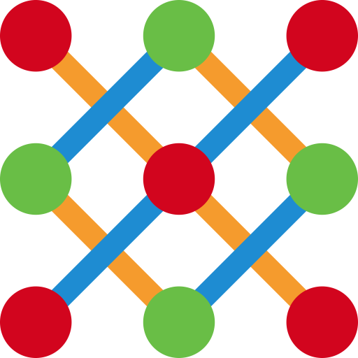

# Weave

**A fine‑grained reactive UI framework — signal‑native, tiny, and TypeScript‑first.**

*No Virtual DOM. No dependency arrays. No ceremony. Just the threads you need, woven tight.*

[📚 **Documentation**](https://weave-framework.github.io/weave/) · [🚀 Get started](https://weave-framework.github.io/weave/) · [🗺️ Roadmap](#-where-its-headed)

---

## 👋 Welcome

Whether you've just stumbled onto Weave or you've been threading along since the early commits — glad you're here.

Weave is a UI framework built around one idea taken all the way: **the screen is a fabric, and reactivity is the thread.** When a value changes, Weave touches *only* the exact part of the page that depends on it. Nothing re‑renders wholesale. Nothing diffs a shadow copy of your UI. You describe your interface once, and from then on your signals do the talking.

The result feels calm: state that updates exactly where it should, a runtime small enough to forget about, and tooling that treats you like a grown‑up. No mental bookkeeping, no “why did this re‑render,” no incantations to make it fast.

---

## 🪡 Woven from the best threads

We love the frameworks that came before. React made components mainstream, Angular brought structure and a real toolchain, Vue made the on‑ramp gentle, Svelte showed how small a runtime can be, Solid proved signals could carry an entire UI. Weave isn't here to dunk on any of them — it's here to take the threads developers reached for again and again, and weave them into one coherent piece of cloth.

So what does Weave do *a little differently*?

- **Signals all the way down.** Reactivity is one model, and it powers everything — from a single piece of text to the router. There's no second system to learn and no observables to bridge.
- **Dependencies track themselves.** Things update when — and only when — what they depend on actually changes. Nothing to declare by hand, nothing to cache, nothing to forget.
- **No Virtual DOM.** Your interface maps straight onto the page, so updates stay surgical and the runtime that ships stays genuinely small.
- **Batteries included, not bolted on.** Routing, state, forms, translations, and motion are all first‑party and share the same reactive core — so they compose instead of competing.
- **A component library cut from the same cloth.** Buttons to data tables to date pickers — a complete set of UI components, themed by one token system and composed rather than duplicated. Not a bolt‑on kit: they're built on the same signals as everything else.
- **Accessible by construction.** Those components are built to the WAI‑ARIA patterns — correct roles and state, full keyboard support, focus management, and reduced‑motion — so the hard parts of accessibility are handled before you write a line.
- **A real IDE citizen.** First‑class VS Code **and** WebStorm support, with the kind of editor experience you'd expect from a mature framework.
- **Honest TypeScript.** Types flow through by inference, your editor understands your UI for free, and there's no decorator boilerplate to wade through.

None of this makes the others "wrong." It's a different set of trade‑offs — small, fast, signal‑native, low‑ceremony — for people who want exactly that.

---

## 🗺️ Where it's headed

Weave's core is solid — signal-native, covered by a broad browser test suite, and dogfooded end to end by a complete demo app. It evolves deliberately, and one rule sits above the rest: *don't break your app.* Stability isn't a milestone we're waiting on — it's the priority today. On the near horizon:

- **Documentation site** — the home this README keeps pointing you toward: live today, and filling in component by component.
- **Server‑side rendering & hydration** — added when there's a real need, with a clean boundary rather than magic strings.
- **Devtools** — a way to watch the fabric update live.
- **More of everything** — the long tail of polish that turns a framework into a daily driver.

Ideas and contributions are welcome — the roadmap is a direction, not a fence.

---

## 📚 Get started

Installation, your first component, guides, and the complete API reference all live in the documentation:

### → **[Read the documentation](https://weave-framework.github.io/weave/)**

---

## 🛡️ Built to be trusted

Weave is *small, fast, signal‑native, and low‑ceremony* — and built to hold up in serious codebases, not just demos. Its sharpest edge is the one large teams worry about most: **zero third‑party runtime dependencies.** No transitive packages, no audit scramble — a supply‑chain attack surface that's effectively nil. Pair that with performance that stays flat as the UI grows, first‑party routing, state, forms, and i18n that share one reactive core, a UI component library built to the WAI‑ARIA accessibility patterns, and type‑checking that reaches all the way into your templates, and you get a framework that scales *with* a team, not against it.

We won't oversell the young parts: SSR/hydration and devtools are on the roadmap, and the ecosystem is still growing. But the foundation is real and tested today — and it's aimed squarely at the work real applications demand.

## License

[MIT](LICENSE) — woven with care. 🧵
